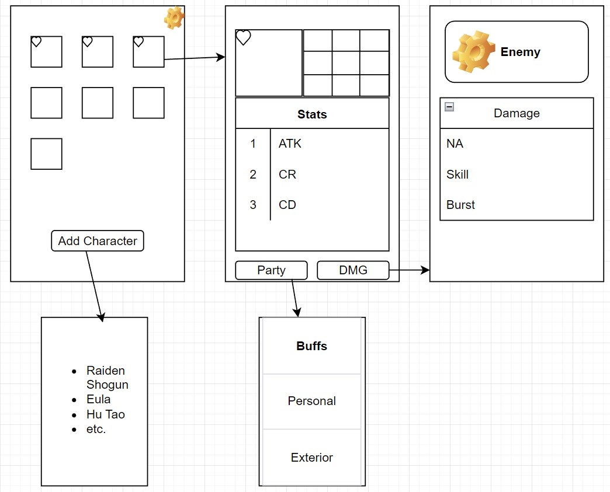

# Opis projekta
## Kratki opis
### Genshin Impact Damage Calculator
Projekt je izrada aplikacije za prikaz *Damage* pojedinih *Characters* iz igrice *Genshin Impact*, protiv konkretnih tipova *Enemy*, radi lakše usporedbe koji je *Build* bolji, ili jednostavno za dobivanje očekivanog *Damage*. 

## Popis funkcionalnosti
1. Dodavanje *Character* na *Home Screen*
2. Unošenje *Cons*, *Skills* i *Stats* odabranog lika na *Character Screen*
3. Mogućnost filtriranja favorita
4. Dodavanje osobnih i eksternih *buffova*(*Party* opcija) 
5. Izbor *Enemy* i prikaz očekivanog *Damage* protiv istih na *Damage Screen*
6. Mogućnost spremanja trenutnog *Build* radi usporedbe s novim

### Idejna struktura aplikacije

